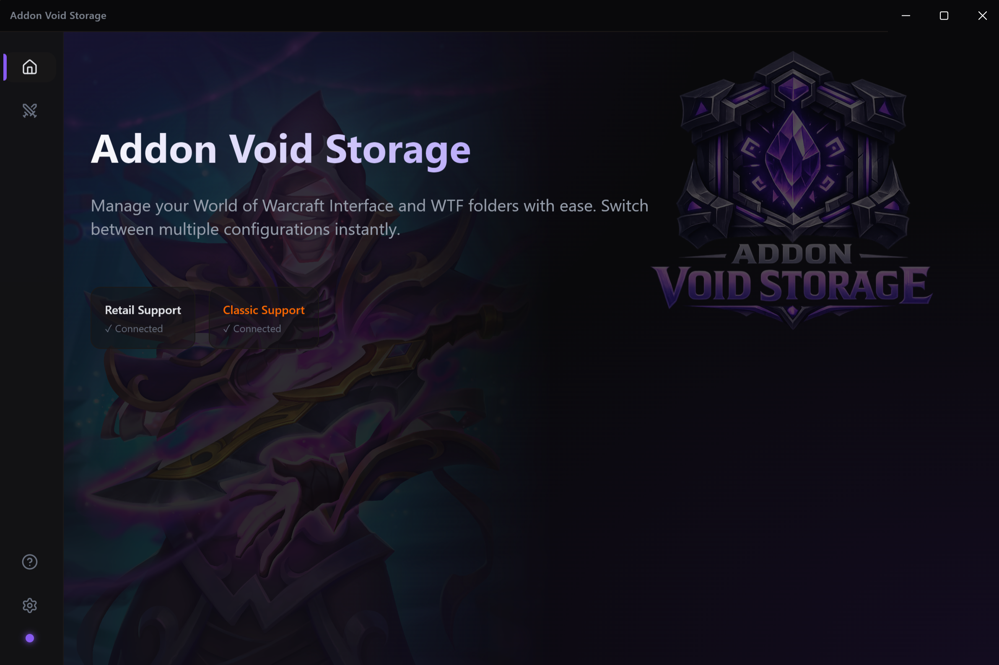

<p align="center">
  
</p>

<h1 align="center">Addon Void Storage</h1>

<p align="center">
  A desktop app for managing your World of Warcraft addon profiles.<br/>
  Save, restore, and swap between different Interface and WTF folder configurations with a single click.
</p>

<p align="center">
  <a href="https://github.com/bazsec/addon-void-storage/releases">Download Latest Release</a>
</p>

---

<p align="center">
  
</p>

## Features

- **Profile Snapshots** - Save your current addon setup as a named profile (e.g., "Raid UI", "PVP Healer", "Leveling")
- **One-Click Restore** - Instantly swap your live game folders with any saved profile
- **Auto-Backup** - Your current state is automatically backed up before every restore, so nothing is lost
- **Retail & Classic** - Full support for both WoW Retail and Classic/Classic Era
- **Addon Scanner** - View all addons in a profile with links to CurseForge, GitHub, and WoWInterface
- **Drag & Drop Reorder** - Organize your profiles however you like
- **Auto-Detect** - Automatically finds your WoW installation
- **Cross-Platform** - Works on Windows and macOS

## Download

Grab the latest installer from the [Releases](https://github.com/bazsec/addon-void-storage/releases) page:

- **Windows** - `.exe` installer
- **macOS** - `.dmg` installer

## Getting Started

1. Download and install the app
2. On first launch, click **Auto-Detect** or manually browse to your WoW `_retail_` or `_classic_` folder
3. Click **Add New** to save your current addon configuration
4. Switch between profiles anytime using **Restore**

> Make sure you've launched WoW at least once before saving profiles, so the Interface and WTF folders exist.

## Development

```bash
# Install dependencies
npm install

# Run in development mode
npm run dev:electron

# Build for current platform
npm run package

# Build for specific platform
npm run package:win
npm run package:mac
```

## Built With

- Electron
- React + TypeScript
- Tailwind CSS
- Vite
